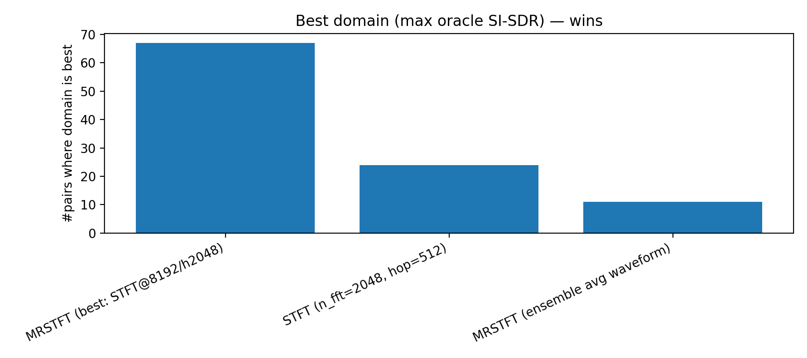
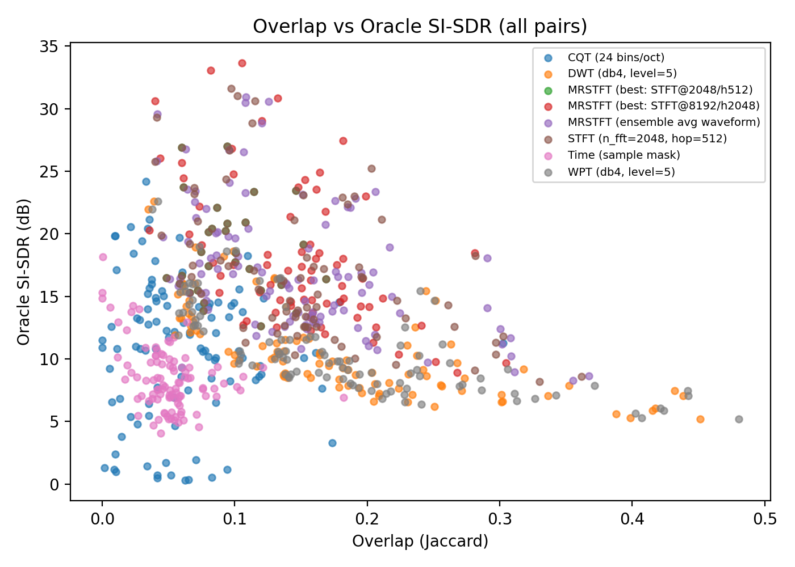
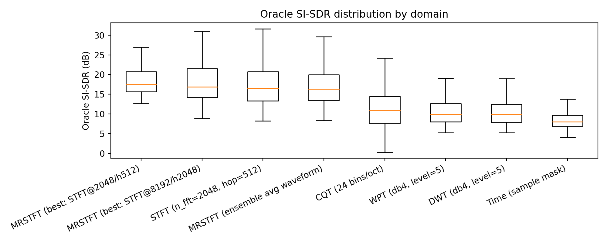
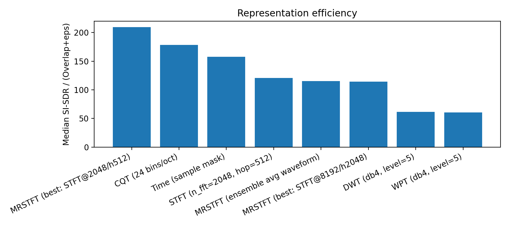
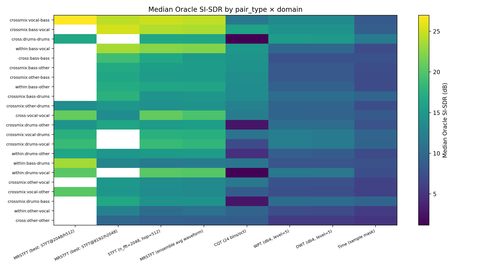

> *Short answer:* not when sources are sparse.  
> *Long answer:* keep reading.

---

## Why I started thinking about this

In audio source separation, we often repeat a comforting story:

> “Sources overlap less in the right representation, so we can separate them.”

It sounds reasonable.  
It sounds mathematical.  
It also sounds like something we’ve all said in talks without questioning too hard.

But at some point, I found myself asking a slightly annoying question:

> **If sparsity is really the reason separation works… why does the time domain fail so badly?**

After all, every sample is just a sum of sources. Surely that’s the *most* overlapped place on Earth?

This blog is the result of poking that question a little too hard.

---

## TL;DR (for impatient readers)

- Low overlap ≠ good separation  
- High overlap ≠ bad separation  
- **Multi-resolution STFT dominates almost everything**
- Structure + resolution alignment matter more than sparsity
- The time domain is sparse, honest, and completely unhelpful

If you want all the math, figures, and rigor, you can download the full technical report here:

**[Technical Report (PDF)](report.pdf)**

---

## What I actually did (no deep learning harmed)

I deliberately avoided training any model.

No U-Nets.  
No diffusion.  
No “our method beats the baseline by 0.3 dB”.

Instead, I asked a simpler question:

> *If a representation were perfect, how well could it separate sources?*

So I ran **oracle ideal ratio masking** experiments across different representations.

### Data

I used MUSDB18HQ music stems: vocals, bass, drums, and other.

I mixed them in every reasonable way:
- vocal–drums  
- vocal–bass  
- drums–drums (yes, chaos)  
- cross-track, within-track, everything

In total: **102 mixtures**.

### Important detail (that reviewers care about)

This is **not** instantaneous mixing.

Each source:
- is convolved with a different room impulse response  
- is mixed at 0 dB SIR  
- has a bit of noise added  

So yes, this is closer to reality than the whiteboard equation we all secretly hate (but still only close, not real! sadly, not adressing non-linearities!).

---

## Representations I tested

For each mixture, I computed oracle masks in:

- Time domain (sample-wise masking)
- STFT (single resolution)
- **Multi-resolution STFT (MRSTFT)**
  - best resolution per mixture
  - naive ensemble (averaging waveforms)
- Constant-Q Transform (CQT)
- Discrete Wavelet Transform (DWT)
- Wavelet Packet Transform (WPT)
- Scattering transform (overlap only, not invertible)

No learning. Just signal processing doing their thing.

---

## First question: which representation actually wins?

### Best-domain wins

This plot shows how often each representation achieves the **highest oracle SI-SDR**.

**What surprised me (a little):**
- MRSTFT (best resolution) wins **67 out of 102 cases**
- Single-resolution STFT does okay
- Everything else… not really

**Interpretation:**  
There is no single “correct” resolution but picking the *right* one per signal matters a lot.

---

## Second question: does less overlap mean better separation?

This is where the story gets interesting.

### Overlap vs oracle SI-SDR

If sparsity were the full explanation, this plot should slope nicely upward.

It does not.

Some highlights:
- Time domain has *very low overlap* and *terrible separation*
- CQT has *higher overlap* but often separates better
- MRSTFT casually ignores the sparsity rule and wins anyway

**Conclusion (sorry sparsity):**  
Low overlap is **neither necessary nor sufficient** for good separation.

This was the point where I stopped trusting one-liners in slide decks.

---

## Let’s look statistically (because anecdotes don’t survive reviews)

### Oracle SI-SDR distributions

Here we see:
- MRSTFT has the highest median
- The strongest upper tail
- And fewer catastrophic failures

Time domain and fixed wavelets are… consistent, but consistently bad.

---

## A better question: how efficiently is overlap used?

Instead of asking *how sparse* a representation is, I asked:

> *How much separation do I get per unit overlap?*

### Representation efficiency

This figure quietly explains everything:
- Time domain is sparse but useless
- STFT uses overlap efficiently
- MRSTFT uses overlap **best**
- Fixed wavelets burn overlap without much payoff

**Moral:**  
It’s not about avoiding overlap, it’s about surviving it.

---

## Is this just a vocal–drums trick?

I checked.

### Pair-type × domain heatmap

Across:
- harmonic–percussive
- harmonic–harmonic
- percussive–percussive
- same-instrument chaos

**MRSTFT stays strong everywhere.**

So no, this isn’t a dataset coincidence.

---

## What this experiment taught me

After staring at these plots longer than I’d like to admit:

1. **Overlap is inevitable in audio**
2. **Sparsity is not the explanation we want it to be**
3. **Structure + resolution alignment matter more**
4. **Multi-resolution beats single-resolution almost always**
5. Naive averaging ≠ intelligence
6. Fixed bases need learning, conditioning, or both

In one sentence:

> **Separation works not because sources are sparse, but because the representation preserves source structure while allowing interference to be suppressed without breaking reconstruction.**

---

## Why this matters (especially for learning-based models)

This directly motivates:
- multi-resolution losses
- adaptive receptive fields
- learned filterbanks
- attention across scales

In other words:

> Don’t hard-code sparsity.  
> Let the model discover *where overlap stops being fatal*.

---

## If you want more details

This blog is the intuition-first version.

For:
- full math  
- exact definitions  
- experimental protocol  
- additional figures  

**[Technical report (PDF)](report.pdf)**

---

## Closing thought

This wasn’t meant to be a flashy separation paper.

It was a **representation sanity check**.

Sometimes, the most useful thing you can do is ask:
> *Why does this work at all?*

And then refuse to accept the first easy answer.

---

*— Rajesh R*

