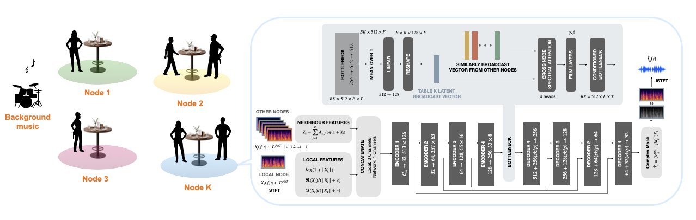

##### Download

+ [Paper](IWAENC2026_Rajesh.pdf)
+ [Demo](https://listeningtech.github.io/restaurant_asn/)
+ [Code and data](https://github.com/listeningtech/restaurant_asn/tree/main/code)
+ [Poster](IWAENC2026_Poster.pdf)

---

##### Abstract

We study node-specific speech enhancement in a distributed acoustic sensor network with one microphone per node, where each node retains its local talkers while suppressing competing speech, music, and background noise. We compare local-only and graph-conditioned models using matched backbone architectures under different communication regimes. Local processing already provides strong gains under favorable conditions, but degrades in low-SNR, high-interference scenarios. In these regimes, cross-node cooperation improves SI-SDR by up to 4.8 dB over the matched local model. We further characterize the performance--bandwidth tradeoff: low-rate bottleneck sharing provides moderate gains, whereas full feature sharing achieves the best performance at substantially higher communication cost.

---

##### Figure: Cooperative Node-Specific Enhancement



---

##### Overview

We consider a distributed conversational environment, such as a restaurant, containing multiple groups of talkers. Each table is represented by an acoustic sensor node equipped with a **single microphone**. The signal observed at each node contains its local talkers together with speech from other tables, background music, and ambient noise.

Unlike conventional enhancement systems, each node has a different target: speech that should be retained at one node acts as interference at the others.

We compare three communication regimes:

+ **Local:** each node processes only its own microphone signal.
+ **Neighborhood:** each node exchanges information with nearby nodes.
+ **Full network:** information from all nodes is available for cooperative enhancement.

All models use the same U-Net backbone. Cooperative models incorporate shared log-magnitude features and cross-node attention to condition the node-specific enhancement network.

---

##### Why Cooperation Helps

Local processing performs well when the acoustic conditions are favorable. However, as the input SNR decreases and interference and reverberation increase, information from other nodes becomes increasingly useful.

For the four-node restaurant scenario, the full-network model improves SI-SDR from **2.45 dB to 7.28 dB** relative to the matched local model under the most difficult acoustic condition, corresponding to a **4.83 dB cooperation gain**.

The cooperation gain increases with acoustic difficulty:

+ **Low difficulty:** +2.11 dB
+ **Medium difficulty:** +2.62 dB
+ **High difficulty:** +4.83 dB

PESQ and STOI follow the same overall trend.

---

##### Performance vs. Communication

More communication generally provides better enhancement, but at a higher bandwidth cost.

Low-rate bottleneck sharing provides a relatively inexpensive cooperative operating point, while sharing spectral features across the network produces substantially larger enhancement gains. In our experiments, bottleneck sharing requires approximately **34.8 kb/s per stream**, compared with approximately **1.03 Mb/s per stream** for input-level feature sharing.

These results suggest that the amount of cooperation should depend on the acoustic conditions: local processing may be sufficient in easier environments, while more information should be exchanged when interference becomes severe.

---

##### Citation

Rajesh R, R. Fernando, Y. Xu, and R. M. Corey, "Cooperative Node-Specific Speech Enhancement in Resource-Constrained Acoustic Sensor Networks," 2026 14th International Workshop on Acoustic Signal Enhancement (IWAENC), 2026.

```BibTeX
@INPROCEEDINGS{rajesh2026cooperative,
  author={R, Rajesh and Fernando, Rashen and Xu, Yuezhong and Corey, Ryan M.},
  title={Cooperative Node-Specific Speech Enhancement in Resource-Constrained Acoustic Sensor Networks},
  booktitle={2026 14th International Workshop on Acoustic Signal Enhancement (IWAENC)},
  year={2026}
}
