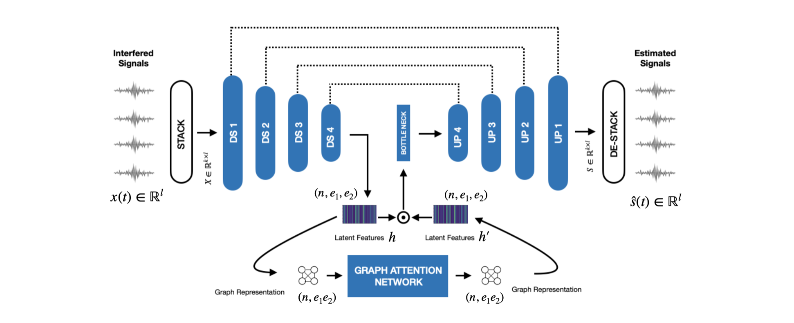

  <a href="">Paper</a> | 
  <a href="https://github.com/its-rajesh/GIRNet">Code and Data</a> |
  <a href="">Xplore</a>

---
##### ARCHITECTURE

---

### Abstract

In live concerts, the microphone that is intended to capture individual sources often ends up picking up neighbouring sources due to the lack of acoustic shielding. This phenomenon can result in interference between the captured audio streams. The process of eliminating the sound of these unintended sources from the primary source is known as interference reduction. In this paper, we present a learning-based framework, the Graph Interference Reduction Network (GIRNet), designed to mitigate interference in live recordings. Diverging from the conventional approach of treating interference as noise, our method focuses on estimating the relationships among various audio sources, thereby facilitating effective interference reduction. Experimental results demonstrate the superior performance of our proposed model compared to existing methods, as evidenced by improvements in Signal-to-Distortion Ratio (SDR). Moreover, our model exhibits promising generalizability to out-of-domain classes through post processing techniques. The outcomes of listening tests underscore the model’s efficacy in the context of live recordings.

---

### Real Data Audio Demo

This recording was captured in a live concert scenario with three microphones. The model was trained on semi-realistic data and evaluated on this unseen condition.

| Live Recordings | GIRNet Cleaned |
|-----------------|----------------|
| <audio controls><source src="/audios/girnet/ex1/bvocal.wav" type="audio/wav"></audio> | <audio controls><source src="/audios/girnet/ex1/mvocal.wav" type="audio/wav"></audio> |
| <audio controls><source src="/audios/girnet/ex1/bviolin.wav" type="audio/wav"></audio> | <audio controls><source src="/audios/girnet/ex1/mviolin.wav" type="audio/wav"></audio> |
| <audio controls><source src="/audios/girnet/ex1/bmridangam.wav" type="audio/wav"></audio> | <audio controls><source src="/audios/girnet/ex1/mmridangam.wav" type="audio/wav"></audio> |

---

### Synthetic Examples

- [Demo with 3 synthetic sources](/papers/girnet/synthetic-demo/)
- [Evaluation on Saraga Indian Art Music](/papers/girnet/saraga-eval/)

---
