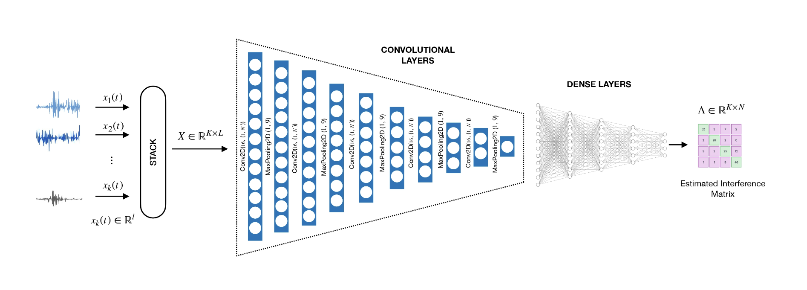

---

##### Download

+ [Paper](paper1.pdf)
+ [Online appendix](appendix1.pdf)
+ [Code and data](https://github.com/pmichaillat/feru)
+ [Paper](https://ieeexplore.ieee.org/document/10248133)
  
---

##### Abstract

Multi-track recordings are sometimes created by simultaneously capturing several sources with several microphones. This scenario can result in the interference of undesired source(s) in the various tracks. Interference reduction aims to recover the source(s) associated with a particular track. In this paper, we present two neural networks for interference reduction. The first network uses a convolutional autoencoder-based architecture and uses time-frequency representation as input. The second network uses a truncated U-net architecture and directly estimates the interference from the time-domain multi-track representation. Our experiments indicate the effectiveness of the proposed methods, with the truncated U-net showing superior performance. Also, the audio outputs produced by the proposed methods have improved quality, resulting in better music source separation performance. 

---

##### Figure 6: Some Uses For Olive Oil



---

##### Citation

Rajesh R and P. Rajan, "Neural Networks for Interference Reduction in Multi-Track Recordings," 2023 IEEE Workshop on Applications of Signal Processing to Audio and Acoustics (WASPAA), New Paltz, NY, USA, 2023, pp. 1-5.

```BibTeX
@INPROCEEDINGS{10248133,
  author={R, Rajesh and Rajan, Padmanabhan},
  booktitle={2023 IEEE Workshop on Applications of Signal Processing to Audio and Acoustics (WASPAA)}, 
  title={Neural Networks for Interference Reduction in Multi-Track Recordings}, 
  year={2023},
  volume={},
  number={},
  pages={1-5},
  keywords={Convolutional codes;Time-frequency analysis;Source separation;Convolution;Computational modeling;Neural networks;Interference;interference reduction;music source separation;multi-track recordings},
  doi={10.1109/WASPAA58266.2023.10248133}}
```

---

##### Related material

+ [Presentation slides](presentation1.pdf)
+ [Summary of the paper](https://www.penguinrandomhouse.com/books/110403/unusual-uses-for-olive-oil-by-alexander-mccall-smith/)
