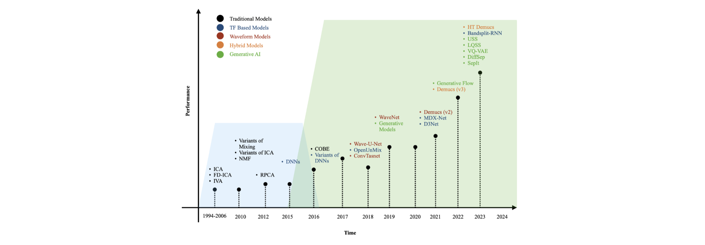

### Music Source Separation for Indian Art Music

Music source separation has achieved remarkable success in Western pop music effectively isolating instruments such as vocals, bass, drums, and others. However, most state-of-the-art (SOTA) models are designed around these fixed instrument types and struggle to generalize to other musical traditions.
In particular, Indian Art Music (IAM), such as Carnatic music, presents a unique challenge: its complex polyphony, tonal structures, and rich harmonic-percussive interplay cause SOTA models to perform poorly.

My goal is to develop a source separation model tailored for the Carnatic domain: one capable of isolating sources such as vocals, mridangam, violin, ghatam, and others.
A robust separation framework for Carnatic music could also enable a wide range of music information retrieval (MIR) tasks, including tonic estimation, rhythmic pattern analysis, and performance structure modeling.

### Approaches

##### Model Adaptation and Fine-Tuning
Utilized several state-of-the-art architectures such as [HT-Demucs](https://arxiv.org/abs/2211.08553) and [Wave-U-Net](https://arxiv.org/abs/1806.03185), fine-tuned on the Saraga dataset: a live multitrack Carnatic corpus.

##### Dataset Challenge: Microphone Bleed
Although Saraga provides multitrack recordings, significant bleed (cross-talk between microphones) severely limits source separation performance.
To address this, my focus shifted toward developing interference-reduction or bleed-reduction techniques.

##### Architectural Experiments
Designed and tested new time–frequency U-Net architectures that explicitly model harmonic and percussive components. Gradually incorporated instrument-specific pathways: adding and refining sources one by one for improved separation quality.

##### Trends in MSS (till 2023)

---

### Materials

+ [Codes and Results](https://github.com/its-rajesh/Wave-U-Net)
  
---

