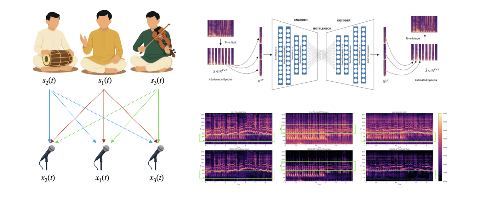

---

##### Download

+ [Paper](paper1.pdf)
+ [Code and data](https://github.com/its-rajesh/IRMR)
+ [Xplore](https://ieeexplore.ieee.org/document/10248133)
  
---

##### Summary

Creating extensive datasets for training source separation models is a time-consuming and resource-intensive task, often requiring acoustically isolated recording environments for each source. While there is a wealth of available live recordings, they cannot be directly utilized for training such models due to the presence of significant bleeding effects. Bleeding refers to the undesired pickup of sound from sources other than the intended one, complicating the task of source separation.

---

### Approaches

##### Learning free optimisation algorithm

We propose a optimization-based technique that iteratively estimates the extent of interference (bleed) between sources and derives clean, interference-free signals from raw time-domain multi-source recordings. These bleed-reduced outputs are used as high-quality training targets for large-scale source separation models. Experiments show that this method significantly outperforms prior spectrogram-based approaches, particularly in terms of Source-to-Distortion Ratio (SDR) and perceptual sound quality.

- Pros: Achieves high SDR performance; produces high-fidelity targets for training.
- Cons: Assumes instantaneous mixing, which limits real-world applicability; slow due to iterative nature.

##### Convolutional Autoencoders

Assuming interference behaves like additive noise, a simple convolutional autoencoder (CAE) is trained separately for each source. The model performs well on both instantaneous and convolutive mixtures, producing clean outputs with competitive SDR values.

- Pros: Effective for convolutive mixtures; fast training; low computational cost.
- Cons: Requires a dedicated CAE per source; phase information is not preserved.

##### t-UNets

This approach models the problem as instantaneous mixing and operates directly in the waveform domain. Neural networks replace optimization routines and learn the interference matrix implicitly. The network captures inter-microphone relationships and leverages them to suppress interference.

- Pros: Fast training; low computational load; fast inference; minimal artifacts.
- Cons: Assumes instantaneous mixing; limited performance on real-world live recordings.

##### GIRNET

GIRNet is designed for convolutive mixtures with additional noise and works in the time domain. It uses a graph attention mechanism to directly estimate interference-reduced signals. Each microphone recording is modeled as a node in a graph, and the graph attention network captures their dependencies to reduce interference.

- Pros: Handles convolutive mixing; performs well on out-of-domain data with post-processing.
- Cons: High training time and compute requirements.

##### Generative based approach

##### Learnable front ends

We incorporate learnable time-domain front-ends (e.g., wavelet or filterbank layers) into the source separation models, enabling task-driven representation learning that can adaptively focus on multiresolution signal features.

- Pros: Learnable representations offer adaptability to different signal conditions, efficient, and high performance.
- Cons: Fixed number of channels.

---
### Results on MUSDB18HQ

We evaluate the proposed approaches on the MUSDB18HQ dataset—a widely-used benchmark for music source separation. To simulate realistic interference, the dataset was augmented with:

- **Instantaneous Mixtures**: Basic signal-level bleed simulation.
- **Reverberant Mixing**: Convolutive mixtures generated using room impulse responses via Pyroomacoustics.

##### Performance of Proposed Models

The table below compares various proposed methods against the baseline KAMIR algorithm. The median SDR (Source-to-Distortion Ratio) is reported across vocal, bass, drums, and other stems:

| Models | Vocal | Bass | Drums | Others | Overall SDR | 
|------|-----|-----|-----|-----|-----|
|[Reference]()| 1.86 | 4.44 | 6.78 | 5.96 | 5.82 | 
|[KAMIR](https://ieeexplore.ieee.org/abstract/document/7178036)| 13.84 | 6.75 | 6.83 | 5.61 | 7.00 |
|[DI-CAE]()| 1.89 | 5.81 | 6.18 | 4.48 | 6.92 | 
|[Optimisation]()*| 39.25 | 42.90 | 44.22 | 42.11 | 42.12 |
|[t-UNet]()| 8.05 | 9.05 | 8.255 | 6.69 | 8.83 |
|[f-UNet]()| 6.50 | 9.84 | 10.85 | 10.32 | 9.38 | 
|[df-UNet]()| 6.50 | 9.84 | 10.85 | 10.32 | 11.54 |
|[df-UNet-GAT]()| 16.50 | 19.84 | 20.85 | 20.32 | __21.54__ |

> \* Optimization is non-real-time and assumes ideal multichannel access.

##### Figure: t-UNet Architecture

---

---

##### Related material

+ [Presentation slides](presentation1.pdf)
