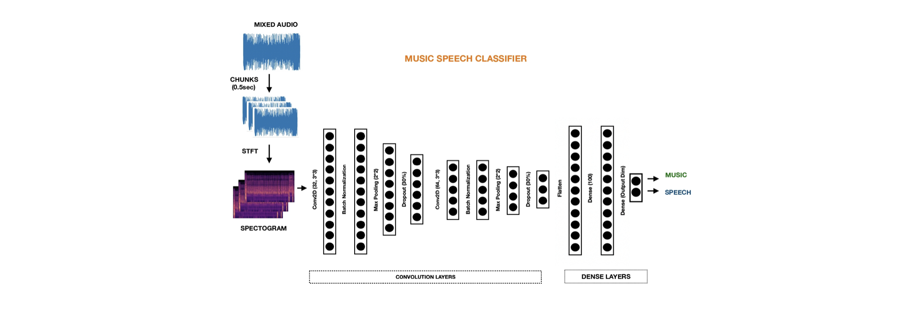

---

##### Download

+ [Technical details](paper1.pdf)
+ [Code and data](https://github.com/its-rajesh/Music-Speech-Separation/)
+ [Pretrained model](https://drive.google.com/file/d/1t2qvemObK1w1GPa3NHYy-IasVGacjcMT/view?usp=drive_link)
  
---

##### Abstract

We propose a deep convolutional neural network architecture for classifying and isolating music and speech components in mixed audio recordings. The system processes short audio chunks using short-time Fourier transform (STFT) to generate spectrogram representations, which are then fed into a series of convolutional and dense layers. Trained to differentiate between music and speech, the model is optimized to completely remove the music component, enabling improved performance in downstream natural language processing (NLP) tasks that require clean speech signals. The framework demonstrates strong potential for preprocessing audio in noisy, music-rich environments.

---

##### Figure: Architecture

---
